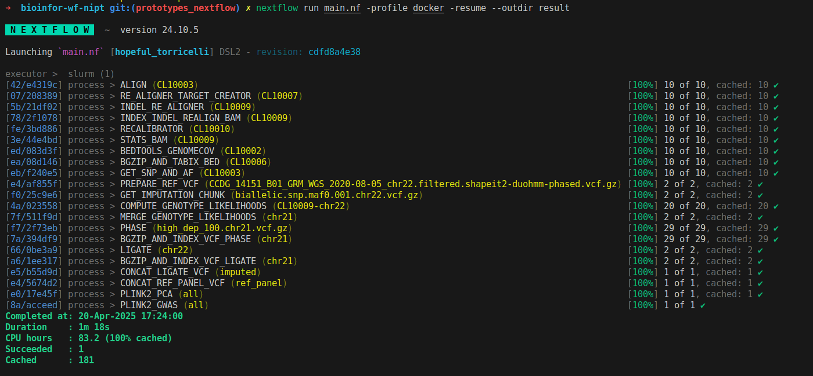

 <h1 align="center">Bioinfor-wf-nipt-human-genetics</h1> 
 
  

## Overview
Bioinfor-wf-nipt-human-genetics is an end-to-end NIPT (Non-Invasive Prenatal Testing) GWAS (Genome-Wide Association Study) pipeline designed for processing fastq files. This pipeline facilitates the analysis of human genetics for NIPT applications and can be easily adapted for various research scenarios.

## Key Features
End-to-end workflow for processing fastq files into NIPT GWAS results.

Designed to handle more than 50 samples for real-world applications.

Collects necessary parameters for easy configuration.

Simplifies the creation of test profiles for easy setup and execution.

## Known Issues
Fix required for the basevar issue to remove intermediate files correctly.

  

For more details, visit the GitHub repository.